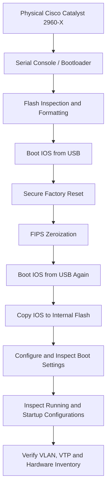

# Cisco Catalyst 2960-X | Hands-On Network Infrastructure Project

### NIST-Aligned Secure Sanitization • Cisco IOS Reinstallation • Boot Configuration • Post-Reimage Verification

<p align="center">
  
</p>

---

## Overview

This project documents hands-on work with a **physical Cisco Catalyst 2960-X (WS-C2960X-24TS-L)** enterprise network switch.

Using Tera Term and a serial-console connection, I accessed the Cisco bootloader and IOS command-line interface to perform equipment sanitization, reinstall Cisco IOS from USB media, configure the boot image, and inspect the switch following reimaging.

The work was performed on actual enterprise networking equipment, not in a simulator.

The equipment-processing environment operates under NIST media sanitization standards. The documented reset and zeroization operations formed part of that process.

This repository contains photographs of the physical equipment, 12 phases of CLI evidence, configuration verification, and a supporting technical report.

| Project Detail | Information |
|---|---|
| Hardware | Cisco Catalyst WS-C2960X-24TS-L |
| Operating System | Cisco IOS |
| IOS Image | `c2960x-universalk9-mz.152-7.E11.bin` |
| Console Application | Tera Term |
| Access Method | Serial Console |
| Recovery Media | USB Flash Drive |
| Environment | Isolated Physical Equipment |
| Sanitization Framework | NIST-aligned organizational procedures |

---

## Table of Contents

- [Equipment Photos](#equipment-photos)
- [Hardware and Tools](#hardware-and-tools)
- [Work Completed](#work-completed)
- [Sanitization Standards](#sanitization-standards)
- [Recovery Workflow](#recovery-workflow)
- [CLI Walkthrough](#cli-walkthrough)
  - [Phase 01 — Flash Formatting](#phase-01)
  - [Phase 02 — IOS Boot from USB](#phase-02)
  - [Phase 03 — Secure Factory Reset](#phase-03)
  - [Phase 04 — FIPS Zeroization](#phase-04)
  - [Phase 05 — Bootloader Inspection](#phase-05)
  - [Phase 06 — Post-Zeroization IOS Boot](#phase-06)
  - [Phase 07 — IOS Installation and Boot Configuration](#phase-07)
  - [Phase 08 — Running Configuration](#phase-08)
  - [Phase 09 — Startup Configuration](#phase-09)
  - [Phase 10 — VLAN Inspection](#phase-10)
  - [Phase 11 — VTP and Power Inspection](#phase-11)
  - [Phase 12 — Hardware Inventory](#phase-12)
- [Verification Summary](#verification-summary)
- [Project Files](#project-files)
- [About](#about)

---

## Equipment Photos

### Cisco Catalyst 2960-X — Full Switch

<p align="center">
  
</p>

*Cisco Catalyst 2960-X enterprise access switch used in this project.*

### Front Panel and SFP Uplinks

<p align="center">
  
</p>

*Front-panel view showing the Gigabit Ethernet interfaces and SFP uplink ports.*

*Equipment photo backgrounds were digitally modified for presentation. CLI screenshots document the actual switch operations.*

<p align="right">
  <a href="#table-of-contents">↑ Back to Table of Contents</a>
</p>

---

## Hardware and Tools

| Component | Details |
|---|---|
| Manufacturer | Cisco Systems |
| Switch | Catalyst WS-C2960X-24TS-L |
| Switch Type | Layer 2 Enterprise Access Switch |
| Ethernet Ports | 24 × 10/100/1000 |
| Uplink Ports | 4 × 1G SFP |
| PoE Support | Non-PoE Model |
| Operating System | Cisco IOS |
| IOS Image | `c2960x-universalk9-mz.152-7.E11.bin` |
| Terminal Software | Tera Term |
| Device Connection | Serial Console |
| Recovery Environment | Cisco Bootloader |
| Installation Media | USB Flash Drive |
| Work Environment | Isolated Physical Switch |

<p align="right">
  <a href="#table-of-contents">↑ Back to Table of Contents</a>
</p>

---

## Work Completed

The following operations were performed and recorded during the switch sanitization and reimaging process:

- Connected to the physical switch using a serial-console connection.
- Accessed the Cisco bootloader environment.
- Inspected and formatted internal flash storage.
- Performed authorized secure factory-reset and FIPS zeroization commands.
- Booted Cisco IOS directly from a USB flash drive.
- Reinstalled the IOS image into internal flash.
- Configured the boot image and inspected the boot settings.
- Reviewed running and startup configurations.
- Checked VLAN and VTP information.
- Inspected the switch's power capability.
- Confirmed the hardware model through Cisco IOS inventory output.
- Documented the process with 12 CLI screenshots.

<p align="right">
  <a href="#table-of-contents">↑ Back to Table of Contents</a>
</p>

---

## Sanitization Standards

The equipment-processing environment follows NIST media sanitization standards, including procedures aligned with **NIST SP 800-88**.

The documented switch operations included secure factory reset, cryptographic zeroization, flash storage management, and post-operation configuration inspection.

Following sanitization, Cisco IOS was reinstalled to internal flash and the switch's boot configuration was inspected.

The screenshots in this repository record the technical operations performed. They do not replace the organization's formal sanitization verification or acceptance records.

<p align="right">
  <a href="#table-of-contents">↑ Back to Table of Contents</a>
</p>

---

## Recovery Workflow



<p align="right">
  <a href="#table-of-contents">↑ Back to Table of Contents</a>
</p>

---

## CLI Walkthrough

The following screenshots document the switch operations performed during sanitization, IOS reinstallation, and post-reimage inspection.

Hardware serial numbers, MAC addresses, and sensitive device identifiers have been redacted where identified in the published evidence.

---

<a id="phase-01"></a>

### Phase 01 — Flash Formatting

**Commands**

```text
format flash:
dir flash:
```

Accessed the internal flash filesystem through the Cisco bootloader.

Formatted internal flash and inspected the directory contents afterward.

The directory listing was used to review the filesystem state before proceeding with the recovery sequence.

**CLI Evidence**


**Result:** Flash formatting and directory inspection were recorded.

<p align="right">
  <a href="#table-of-contents">↑ Back to Table of Contents</a>
</p>

---

<a id="phase-02"></a>

### Phase 02 — IOS Boot from USB

**Command**

```text
boot usbflash0:c2960x-universalk9-mz.152-7.E11.bin
```

Loaded Cisco IOS directly from the USB recovery image through the bootloader.

This provided access to the IOS operating environment after internal flash handling.

**CLI Evidence**


**Result:** USB-based IOS boot activity was recorded.

<p align="right">
  <a href="#table-of-contents">↑ Back to Table of Contents</a>
</p>

---

<a id="phase-03"></a>

### Phase 03 — Secure Factory Reset

**Command**

```text
factory-reset all secure
```

Executed the authorized secure factory-reset command as part of the equipment sanitization process.

The terminal displayed the reset confirmation and information about the data targeted by the operation.

**CLI Evidence**


**Result:** Secure factory-reset command activity and console prompts were recorded.

<p align="right">
  <a href="#table-of-contents">↑ Back to Table of Contents</a>
</p>

---

<a id="phase-04"></a>

### Phase 04 — FIPS Zeroization

**Commands**

```text
configure terminal
fips zeroize
```

Performed the zeroization operation to clear applicable cryptographic security material and reset associated security state.

The console displayed the corresponding prompts and system response.

**CLI Evidence**


**Result:** FIPS zeroization command activity was recorded.

<p align="right">
  <a href="#table-of-contents">↑ Back to Table of Contents</a>
</p>

---

<a id="phase-05"></a>

### Phase 05 — Bootloader Inspection

**Commands**

```text
set
dir usbflash0:
```

Inspected the bootloader environment variables and verified that the USB storage device contained the IOS recovery image.

The `set` command displayed the switch's bootloader environment settings.

The `dir usbflash0:` command displayed the files available on the recovery media.

**CLI Evidence**


**Result:** Bootloader settings and USB storage contents were inspected.

<p align="right">
  <a href="#table-of-contents">↑ Back to Table of Contents</a>
</p>

---

<a id="phase-06"></a>

### Phase 06 — Post-Zeroization IOS Boot

**Command**

```text
boot usbflash0:c2960x-universalk9-mz.152-7.E11.bin
```

Booted Cisco IOS from the USB flash drive again after the sanitization and zeroization operations.

This restored access to IOS for reinstalling the image into internal flash.

**CLI Evidence**


**Result:** The second USB-based IOS boot was recorded.

<p align="right">
  <a href="#table-of-contents">↑ Back to Table of Contents</a>
</p>

---

<a id="phase-07"></a>

### Phase 07 — IOS Installation and Boot Configuration

**IOS Image Transfer**

```text
copy usbflash0: flash:
```

**IOS Image**

`c2960x-universalk9-mz.152-7.E11.bin`

**Boot Configuration**

```text
configure terminal
boot system flash:c2960x-universalk9-mz.152-7.E11.bin
end
copy running-config startup-config
show boot
```

Copied the Cisco IOS image from USB media into the switch's internal flash storage.

Configured the boot statement to reference the installed IOS image and saved the running configuration.

Used `show boot` to inspect the configured boot path.

**CLI Evidence**


**Result:** IOS installation, boot configuration, and boot-path inspection were recorded.

<p align="right">
  <a href="#table-of-contents">↑ Back to Table of Contents</a>
</p>

---

<a id="phase-08"></a>

### Phase 08 — Running Configuration

**Command**

```text
show running-config
```

Inspected the active Cisco IOS configuration following reinstallation.

The running configuration was reviewed for existing device settings and configuration information.

**CLI Evidence**


**Result:** Active configuration output was recorded.

<p align="right">
  <a href="#table-of-contents">↑ Back to Table of Contents</a>
</p>

---

<a id="phase-09"></a>

### Phase 09 — Startup Configuration

**Command**

```text
show startup-config
```

Inspected the saved startup configuration following IOS reinstallation.

The startup configuration was reviewed separately from the running configuration to confirm the saved device state.

**CLI Evidence**


**Result:** Saved configuration output was recorded.

<p align="right">
  <a href="#table-of-contents">↑ Back to Table of Contents</a>
</p>

---

<a id="phase-10"></a>

### Phase 10 — VLAN Inspection

**Command**

```text
show vlan
```

Inspected the switch's VLAN database following the reimage.

The captured output displayed default VLAN information, including VLAN 1 and the reserved VLAN entries.

No customer-created VLAN was visible in the supplied screenshot.

**CLI Evidence**


**Result:** VLAN database information was recorded.

<p align="right">
  <a href="#table-of-contents">↑ Back to Table of Contents</a>
</p>

---

<a id="phase-11"></a>

### Phase 11 — VTP and Power Inspection

**Commands**

```text
show vtp status
show power inline
```

Reviewed the switch's VLAN Trunking Protocol configuration and power-delivery capability.

The VTP output provided information about the switch's VLAN management state.

The WS-C2960X-24TS-L is a non-PoE model, so PoE functionality is not supported.

**CLI Evidence**


**Result:** VTP status and power-related output were recorded.

<p align="right">
  <a href="#table-of-contents">↑ Back to Table of Contents</a>
</p>

---

<a id="phase-12"></a>

### Phase 12 — Hardware Inventory

**Command**

```text
show inventory
```

Inspected the hardware inventory to confirm the physical switch model.

The output identified the equipment as a **Cisco Catalyst WS-C2960X-24TS-L**.

Device serial-number information was redacted from the published screenshot.

**CLI Evidence**


**Result:** Hardware model and inventory information were recorded.

<p align="right">
  <a href="#table-of-contents">↑ Back to Table of Contents</a>
</p>

---

## Verification Summary

| Verification Item | Status |
|---|---|
| Physical Cisco switch access | Documented |
| Bootloader access and inspection | Recorded |
| Internal flash formatting | Recorded |
| USB-based Cisco IOS boot | Recorded |
| Secure factory-reset operation | Recorded |
| FIPS zeroization operation | Recorded |
| IOS image installation to internal flash | Recorded |
| Boot statement configuration | Recorded |
| Boot-path inspection | Recorded |
| Running configuration review | Recorded |
| Startup configuration review | Recorded |
| VLAN database inspection | Recorded |
| VTP inspection | Recorded |
| Hardware inventory identification | Recorded |
| Independent reboot without USB media | Not documented |
| Physical port connectivity testing | Not documented |
| Formal sanitization acceptance | Not included in public evidence |

The recorded verification results are based on the available console screenshots.

<p align="right">
  <a href="#table-of-contents">↑ Back to Table of Contents</a>
</p>

---

## Project Files

### Technical Report

[View Technical Project Report (PDF)](Cisco_2960X_Sanitation%2BReimage.pdf)

### Repository Structure

```text
Cisco-Catalyst-2960X-Hands-On-Infrastructure-Project/
│
├── README.md
│
├── Cisco_2960X_Sanitation+Reimage.pdf
│
├── assets/
│   ├── brandons-logo.png
│   ├── c2960x-whole.png
│   └── c2960x-front.png
│
└── evidence/
    ├── 2960x-step1.png
    ├── 2960x-step2.png
    ├── 2960x-step3.png
    ├── 2960x-step4.png
    ├── 2960x-step5.png
    ├── 2960x-step6.png
    ├── 2960x-step7.png
    ├── 2960x-step8.png
    ├── 2960x-step9.png
    ├── 2960x-step10.png
    ├── 2960x-step11.png
    └── 2960x-step12.png
```

The `assets/` directory contains the equipment photographs and branding.

The `evidence/` directory contains the terminal screenshots from each documented phase.

The PDF provides a separate technical record of the sanitization and IOS reinstallation process.

<p align="right">
  <a href="#table-of-contents">↑ Back to Table of Contents</a>
</p>

---

## About

I'm Brandon Stevenson, an IT Infrastructure Technician working with enterprise server and network equipment.

My experience includes physical infrastructure servicing, Cisco networking equipment, server management interfaces, operating-system imaging, hardware troubleshooting, and technical documentation.

This repository documents one of my hands-on infrastructure projects using physical enterprise networking hardware.

**Portfolio:** [brandons-resume.com](https://brandons-resume.com)

**GitHub:** [Programmer-stevenson](https://github.com/Programmer-stevenson)

**LinkedIn:** [Brandon Stevenson](https://www.linkedin.com/in/brandon-in-tech/)

---

*This project documents technical operations performed on enterprise equipment. Public release of employer-owned documentation and screenshots requires appropriate authorization. The repository is not an official sanitization certificate.*

<p align="right">
  <a href="#table-of-contents">↑ Back to Table of Contents</a>
</p>
