# Cisco Catalyst 2960-X | Hands-On Network Infrastructure Engineering Project

### Secure Data Sanitization • Cisco IOS Recovery • Boot Configuration • Hardware Verification • Post-Recovery Validation


<p align="center">
  
</p>


## Project Overview

This real-world, physical, hands-on network infrastructure project documents the secure data sanitization, Cisco IOS recovery, boot configuration, and post-recovery validation of a **Cisco Catalyst 2960-X (WS-C2960X-24TS-L)** enterprise access switch.

Unlike a simulated networking lab, this project involved working directly with physical enterprise networking equipment through a serial-console connection, the Cisco switch bootloader, Cisco IOS CLI, and USB-based software recovery.

The project demonstrates hands-on experience with:

- Enterprise Cisco network hardware servicing
- Cisco IOS image recovery and installation
- Bootloader access and flash filesystem management
- Secure factory-reset and zeroization operations
- USB-to-flash IOS image transfer
- Boot variable configuration and verification
- Running and startup configuration inspection
- VLAN and VTP state verification
- Hardware identification and inventory validation
- CLI troubleshooting and technical documentation

**Project Scope:** This was performed on an isolated physical switch, not a production network. The documentation represents observed operations and available CLI evidence rather than a full production deployment or formal sanitization certification.

---


## Physical Equipment Gallery

### Cisco Catalyst 2960-X — Full Switch Overview

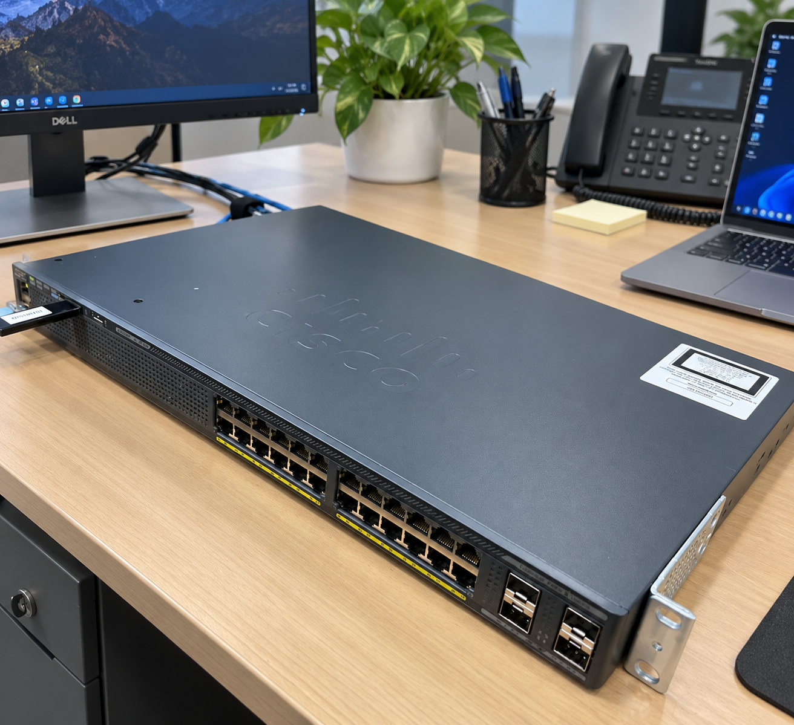

*Full view of the physical Cisco Catalyst 2960-X used in this hands-on infrastructure project.*

### Cisco Catalyst 2960-X — Front Panel and SFP Uplinks

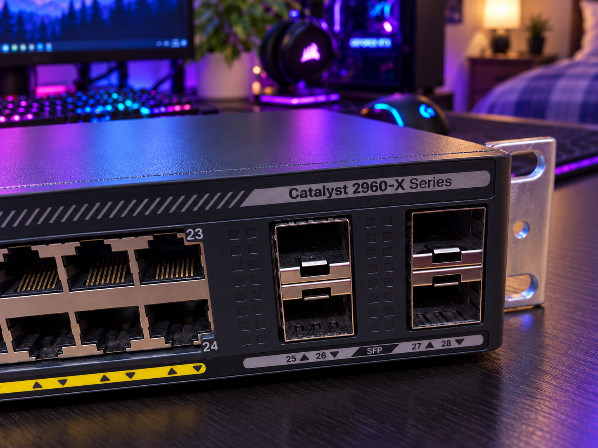

*Close-up of the Gigabit Ethernet ports and SFP uplink interfaces.*


---

## Technical Environment

| Component | Specification |
|---|---|
| Manufacturer | Cisco Systems |
| Device | Catalyst 2960-X |
| Model | WS-C2960X-24TS-L |
| Operating System | Cisco IOS |
| Recovery Image | `c2960x-universalk9-mz.152-7.E11.bin` |
| Access Interfaces | 24 × Gigabit Ethernet |
| Uplink Interfaces | 4 × 1G SFP |
| Console Application | Tera Term |
| Connection | Serial Console |
| Recovery Environment | Cisco Switch Bootloader |
| Installation Media | USB Flash Drive |
| Operating Environment | Offline / Isolated |
| Equipment Type | Physical Enterprise Network Switch |

---

# 1. Project Objectives

The primary objective was to prepare a Cisco Catalyst 2960-X switch for further processing through secure sanitization, operating-system recovery, and technical validation.

### Engineering Objectives

1. Access the switch's bootloader environment.
2. Inspect and manage internal flash storage.
3. Execute authorized secure-sanitization operations.
4. Boot the Cisco IOS recovery image from USB.
5. Restore the IOS image into internal flash.
6. Configure the appropriate boot variable.
7. Verify the configured boot image.
8. Inspect the active and saved configurations.
9. Verify VLAN and VTP information.
10. Confirm the switch hardware model.
11. Review the system's post-recovery condition.
12. Preserve command-line evidence and document technical findings.

---

# 2. Technical Implementation Walkthrough

The following sections explain the commands used during the project, their technical purpose, and the available evidence.

## Phase 1 — Flash Storage Inspection and Formatting

### Commands

```bash
format flash:
dir flash:
```

### Technical Explanation

The switch's bootloader environment provides low-level access to its internal flash filesystem.

The `format flash:` command formats the internal flash filesystem, removing its existing contents.

The `dir flash:` command lists the remaining files and directories and helps confirm the resulting filesystem state.

These operations support device recovery and sanitization workflows, but formatting alone does not establish that all customer data has been securely sanitized.

### CLI Evidence

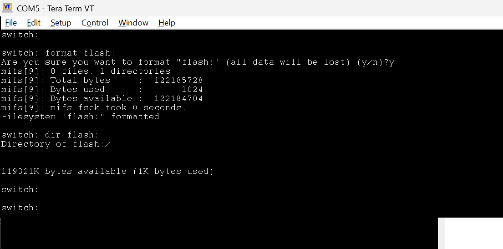

**Observed result:** Flash formatting and filesystem inspection were captured.

---

## Phase 2 — Cisco IOS Boot from USB

### Command

```bash
boot usbflash0:c2960x-universalk9-mz.152-7.E11.bin
```

### Technical Explanation

After handling the internal flash filesystem, Cisco IOS was loaded from removable USB storage.

The bootloader was directed to locate and execute the specified IOS image.

This method enables operating-system recovery when the internal image has been removed, damaged, or made unavailable.

### CLI Evidence

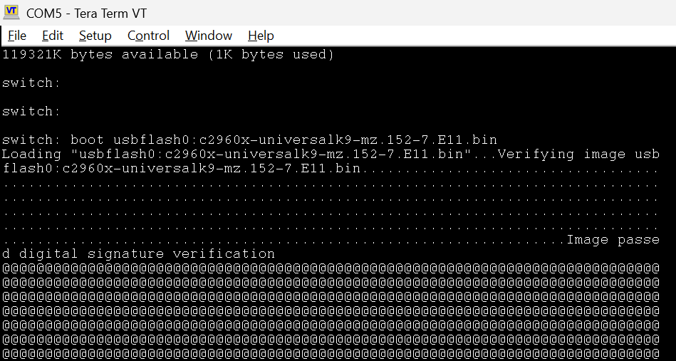

**Observed result:** USB-based IOS boot activity was captured.

---

## Phase 3 — Secure Factory Reset

### Command

```bash
factory-reset all secure
```

### Technical Explanation

The secure factory-reset operation is designed to remove applicable system information and persistent customer data from supported Cisco platforms.

Depending on the software and platform, affected information can include:

- Startup and running configuration data
- Stored IOS images
- System logs
- User-created files
- Supported persistent security information
- Bootloader variables

The command is destructive and was performed within an authorized equipment-sanitization workflow.

### CLI Evidence

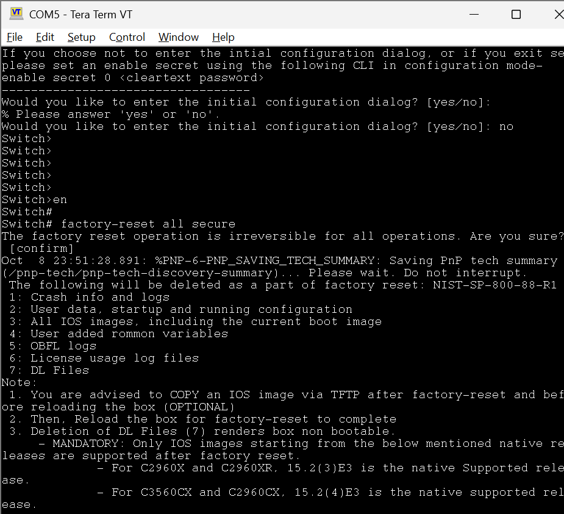

**Observed result:** The secure factory-reset operation and associated console prompts were documented.

**Validation note:** A reset command appearing in console output is not, by itself, sufficient evidence of complete sanitization.

---

## Phase 4 — FIPS Zeroization

### Commands

```bash
configure terminal
fips zeroize
```

### Technical Explanation

FIPS zeroization removes applicable cryptographic information and resets associated security state.

Depending on platform behavior, zeroization may also remove files or images and initiate a system restart.

This operation provides an additional security-control step within the approved sanitization process.

### CLI Evidence

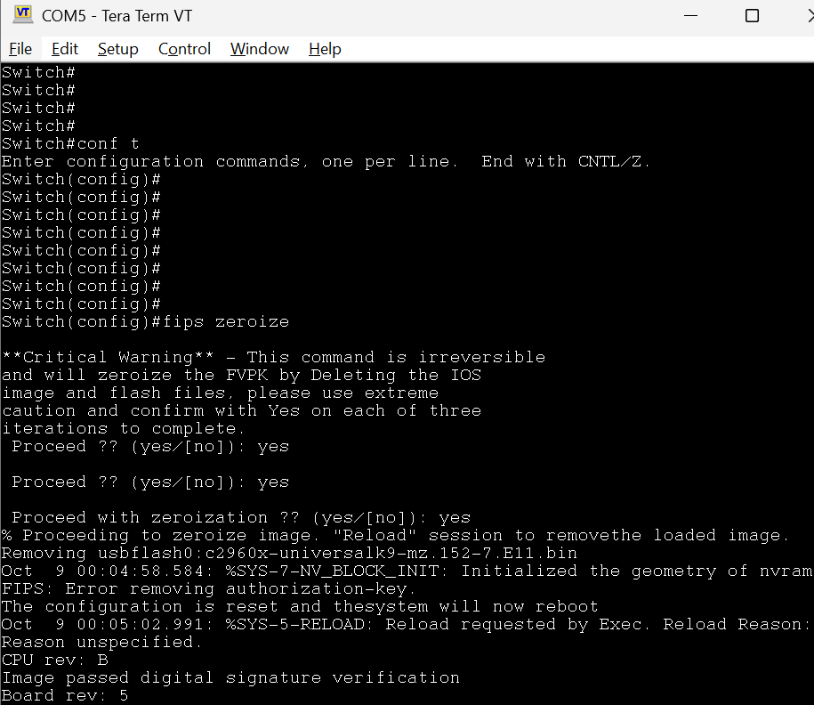

**Observed result:** Zeroization-related command activity and console messages were captured.

---

## Phase 5 — Bootloader Environment Verification

### Commands

```bash
set
dir usbflash0:
```

### Technical Explanation

The `set` command displays bootloader environment variables.

These variables may contain information relating to:

- Boot image location
- Device hardware identification
- Reset state
- Stack membership
- Platform-specific boot settings

The USB filesystem was also inspected to locate the recovery image.

### CLI Evidence

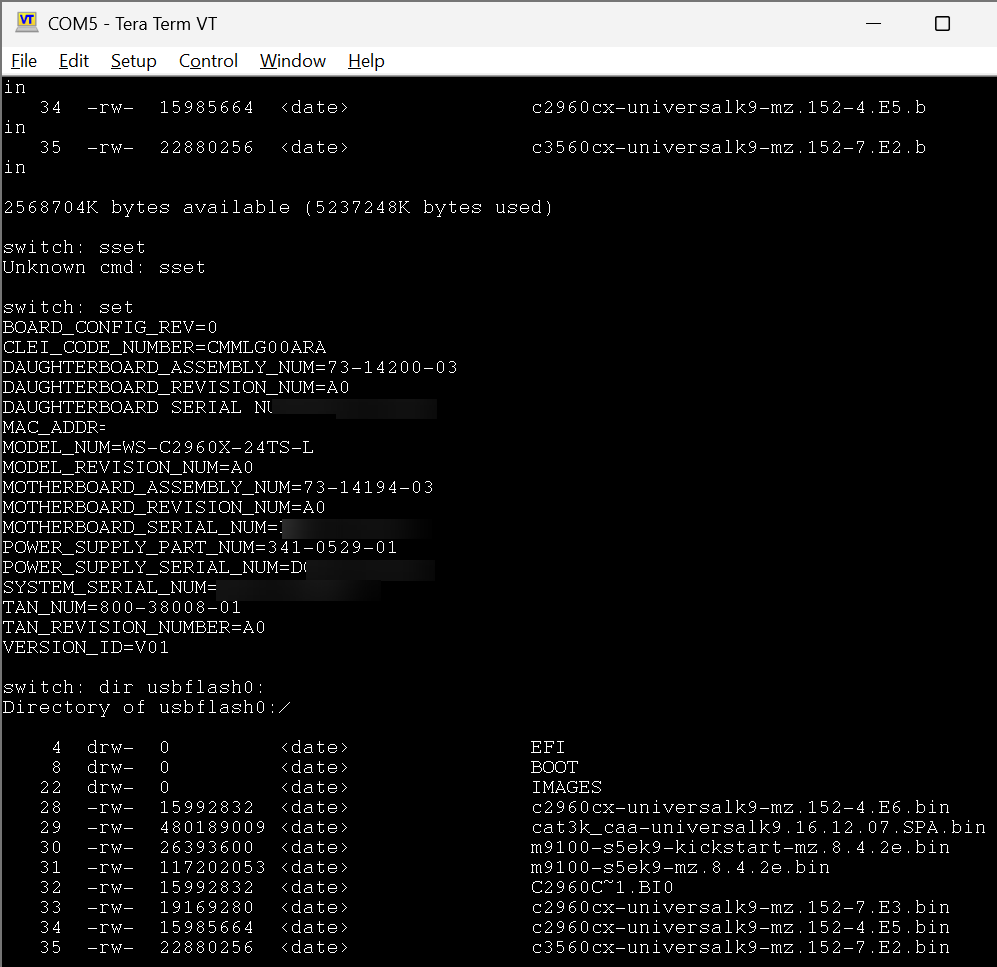

**Observed result:** Bootloader variables and USB filesystem information were inspected.

Identifying serial-number information was redacted from the published evidence.

---

## Phase 6 — IOS Recovery After Zeroization

### Command

```bash
boot usbflash0:c2960x-universalk9-mz.152-7.E11.bin
```

### Technical Explanation

Following the reset and zeroization sequence, the Cisco IOS recovery image was loaded from USB again.

This restored access to the normal IOS command-line environment so that the approved software image could be copied back into internal flash.

### CLI Evidence

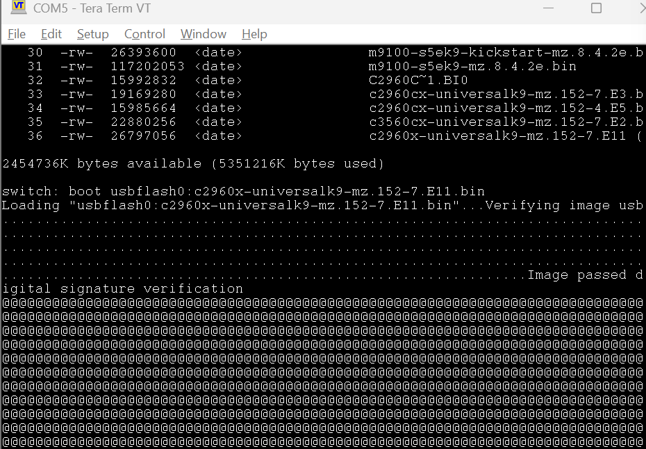

**Observed result:** The post-zeroization IOS recovery sequence was documented.

---

## Phase 7 — IOS Installation and Boot Variable Configuration

### IOS Image Transfer

```bash
copy usbflash0: flash:
```

Source image:

```text
c2960x-universalk9-mz.152-7.E11.bin
```

### Boot Configuration

```bash
configure terminal
boot system flash:c2960x-universalk9-mz.152-7.E11.bin
end
copy running-config startup-config
show boot
```

### Technical Explanation

The approved IOS image was copied from USB storage into the switch's internal flash.

The boot configuration was then updated to reference the intended IOS image.

The boot setting was inspected using `show boot`.

### Why Boot Variables Matter

A switch can contain a valid operating-system image but still fail to start if the boot configuration references an incorrect image location.

Boot validation therefore includes two distinct checks:

1. Confirming the IOS image exists in internal flash.
2. Confirming the boot configuration references that image.

### CLI Evidence

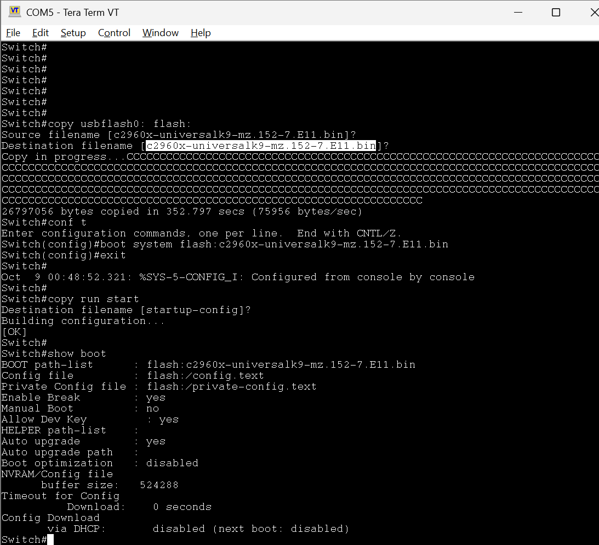

**Observed result:** Image recovery, boot configuration, and boot-variable inspection were captured.

**Limitation:** A successful independent reboot from internal flash without USB was not documented in the supplied evidence.

---

## Phase 8 — Running Configuration Inspection

### Command

```bash
show running-config
```

### Technical Explanation

The running configuration represents the active configuration currently held in memory.

Inspecting this configuration helps identify device-specific settings that may require review.

Examples include:

- Hostname
- Interface configuration
- VLAN assignments
- Management addressing
- Authentication settings
- Remote-management settings
- Boot configuration

### CLI Evidence

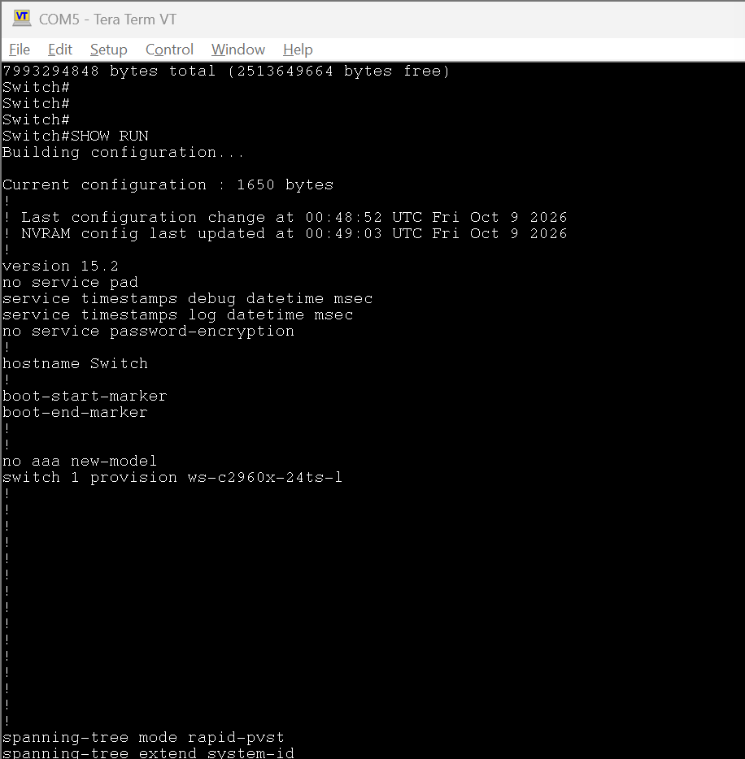

**Observed result:** Running configuration information was captured.

---

## Phase 9 — Startup Configuration Inspection

### Command

```bash
show startup-config
```

### Technical Explanation

The startup configuration contains the saved configuration intended for use during subsequent boot operations.

This configuration is distinct from the running configuration.

Comparing the two helps identify settings that have been saved versus changes that exist only in memory.

During IOS recovery, saving the boot configuration may intentionally create a startup configuration. The final state must comply with the applicable processing requirements.

### CLI Evidence

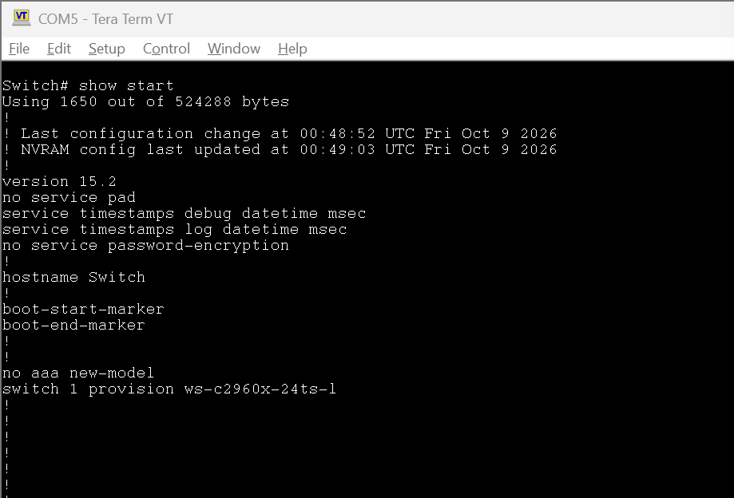

**Observed result:** Startup configuration information was documented.

---

## Phase 10 — VLAN Database Verification

### Command

```bash
show vlan
```

### Technical Explanation

The VLAN database was inspected to review existing VLAN information.

On a Cisco Catalyst switch, default VLAN 1 and reserved legacy VLANs 1002–1005 are expected.

Unexpected VLAN entries can indicate residual configuration requiring further investigation.

### CLI Evidence

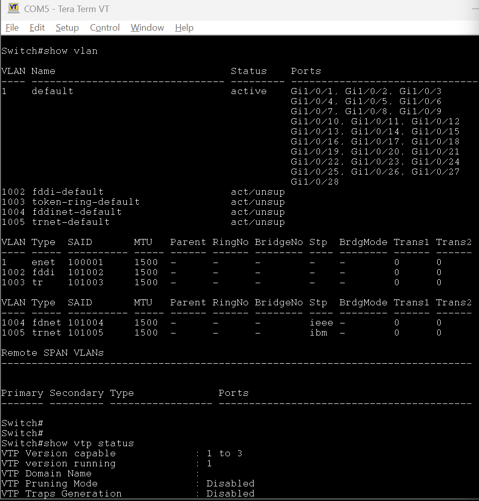

**Observed result:** Default VLAN information was visible in the captured output.

No custom VLAN was visible in the supplied screenshot.

---

## Phase 11 — VTP and Power Capability Inspection

### Commands

```bash
show vtp status
show power inline
```

### Technical Explanation

VLAN Trunking Protocol (VTP) information was reviewed to inspect the switch's VLAN management configuration.

Relevant information includes:

- VTP operating mode
- VTP version
- VTP domain
- VLAN management state
- Configuration revision

The `show power inline` command was also used to inspect supported power-delivery capability.

### Hardware Consideration

The WS-C2960X-24TS-L is a non-PoE switch.

Therefore, unavailable PoE functionality is expected and should not be considered a hardware fault.

### CLI Evidence

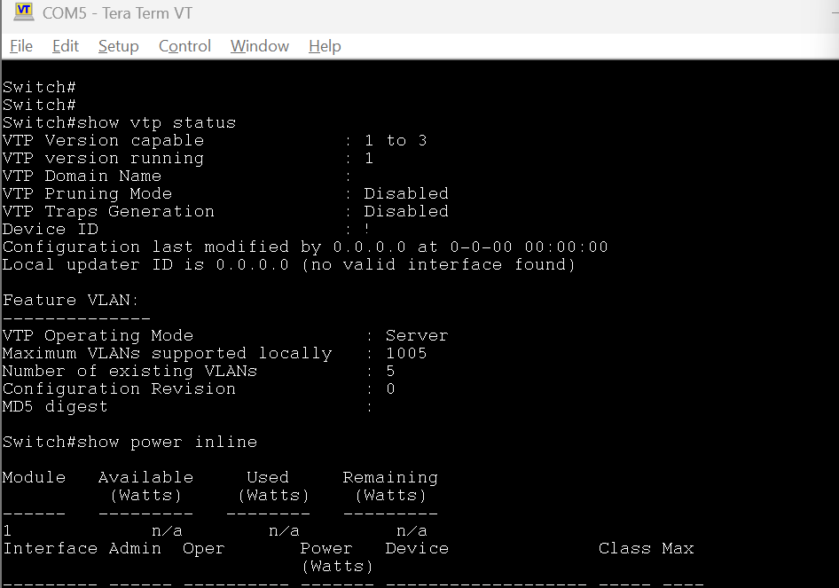

**Observed result:** VTP status and power capability information were captured.

---

## Phase 12 — Hardware Inventory Validation

### Command

```bash
show inventory
```

### Technical Explanation

The `show inventory` command displays hardware identification information for supported components.

This is useful for:

- Confirming the physical switch model
- Reviewing installed hardware
- Validating equipment identification
- Supporting technical inventory documentation

### CLI Evidence

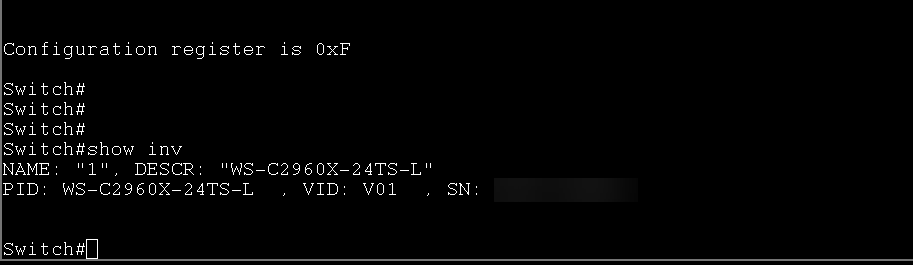

**Observed result:** The Cisco Catalyst WS-C2960X-24TS-L hardware model was identified.

Serial-number information was redacted.

---

# 3. Technical Verification Matrix

The following matrix distinguishes documented activity from tests that were not captured.

| Validation Item | Status |
|---|---|
| Physical enterprise switch used | Documented |
| Internal flash formatting | Observed |
| USB-based IOS boot | Observed |
| Secure factory-reset operation | Observed |
| FIPS zeroization operation | Observed |
| IOS image recovery into flash | Observed |
| Boot variable configuration | Observed |
| Boot variable inspection | Observed |
| Running configuration inspection | Observed |
| Startup configuration inspection | Observed |
| VLAN database verification | Observed |
| VTP configuration inspection | Observed |
| Hardware model identification | Observed |
| IOS checksum comparison with trusted reference | Not documented |
| Independent reboot from internal flash | Not documented |
| Complete Ethernet port-health testing | Not documented |
| SFP uplink traffic validation | Not documented |
| Formal sanitization audit acceptance | Not included in public evidence |

These results describe the available screenshots and should not be interpreted as a complete hardware certification.

---

# 4. Additional Infrastructure Diagnostics

The following commands are useful for future authorized hardware-validation exercises.

**These additional tests are reference material and are not claimed as completed during this documented project.**

## System Health

```bash
show version
show inventory
show env all
show processes cpu sorted
show memory statistics
show logging
```

### Engineering Purpose

These commands help evaluate:

- Running software version
- Device inventory
- Fan and environmental health
- Processor utilization
- Available memory
- System warnings and errors

---

## Ethernet Interface Diagnostics

```bash
show interfaces status
show interfaces description
show interfaces counters errors
show interfaces status err-disabled
show interfaces gigabitEthernet1/0/1
```

### Engineering Purpose

These commands help inspect:

- Physical link status
- Interface speed and duplex
- CRC and packet errors
- Error-disabled states
- Individual interface statistics

A disconnected interface is not automatically defective.

Full port-health testing requires suitable test equipment and controlled traffic.

---

## Boot and Flash Integrity

```bash
show boot
show version
dir flash:
```

These commands help confirm the current software image, configured boot target, and internal flash contents.

A controlled independent boot from internal flash provides stronger validation when authorized.

---

# 5. Engineering Skills Demonstrated

## Cisco IOS Recovery

Recovered operating-system functionality through bootloader access and USB-based IOS loading.

## Flash Storage Management

Worked with internal flash storage and removable recovery media.

## Boot Configuration

Configured and inspected the boot image path required for system startup.

## Secure Data Sanitization

Performed authorized reset and zeroization operations as part of physical enterprise equipment processing.

## Configuration Verification

Reviewed active and saved configurations, VLAN information, and VTP state.

## Hardware Inventory Validation

Used Cisco CLI commands to confirm the switch model and equipment information.

## Technical Documentation

Recorded terminal evidence and explained the technical purpose of the observed operations.

---

# 6. Key Engineering Takeaways

1. A successful IOS boot does not independently prove secure data sanitization.

2. An IOS image stored in flash does not guarantee the boot variable references the correct image.

3. Bootloader recovery and normal Cisco IOS administration operate in different command environments.

4. Running and startup configurations must be inspected separately.

5. Default VLANs must be distinguished from customer-created VLANs.

6. Hardware capabilities must be evaluated using the exact switch model.

7. Physical port testing requires more evidence than simply seeing interfaces listed in the CLI.

8. Engineering documentation should clearly separate completed operations from recommended future testing.

---

# 7. Project Documentation

For the complete formatted technical report, see:

[**Cisco Catalyst 2960-X Engineering Validation Report (PDF)**](Cisco_2960X_Engineering_Validation_Report.pdf)

---

# 8. Repository Structure

```text
Cisco-2960X-Hands-On-Infrastructure-Project/
│
├── README.md
│
├── c2960x-whole.png
├── c2960x-front.png
│
├── Cisco_2960X_Engineering_Validation_Report.pdf
│
├── assets/
│   └── brandons-logo.png
│
└── evidence/
    ├── 2960x-step1.png
    ├── 2960x-step2.png
    ├── 2960x-step3.png
    ├── 2960x-step4.png
    ├── 2960x-step5.png
    ├── 2960x-step6.png
    ├── 2960x-step7.png
    ├── 2960x-step8.png
    ├── 2960x-step9.png
    ├── 2960x-step10.png
    ├── 2960x-step11.png
    └── 2960x-step12.png
```

---

# 9. About This Project

This project is part of my hands-on IT infrastructure and network engineering portfolio.

My focus is developing practical experience in enterprise networking, systems administration, infrastructure troubleshooting, cloud engineering, and technical automation.

This project was completed using **real physical enterprise networking equipment**, not Packet Tracer or a virtual simulator.

### Documentation and Security Disclaimer

The published material is intended to document technical concepts and authorized work. Any equipment screenshots must be approved for public release by the equipment owner.

Device serial numbers were redacted from the CLI evidence. This project does not reproduce a confidential internal operating procedure or represent an official sanitization certificate.

---

**Brandon Stevenson — IT Infrastructure & Network Engineering**

[Portfolio Website](https://brandons-resume.com) | [GitHub](https://github.com/Programmer-stevenson) | [LinkedIn](https://www.linkedin.com/in/brandon-in-tech/)

