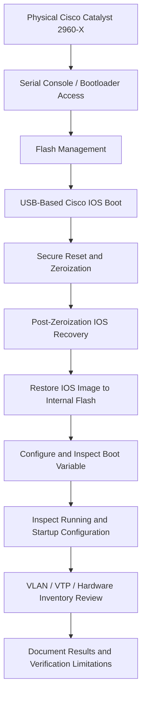

# Cisco Catalyst 2960-X | Hands-On Network Infrastructure Engineering

### Physical Enterprise Hardware • Secure Sanitization • Cisco IOS Recovery • Boot Configuration • Post-Recovery Validation

<p align="center">
  
</p>

<p align="center">
  <strong>Real Hardware. Real CLI. Real Infrastructure Experience.</strong>
</p>

---

## Project Overview

This hands-on network infrastructure project documents the secure sanitization, Cisco IOS recovery, boot configuration, and post-recovery inspection of a **Cisco Catalyst 2960-X (WS-C2960X-24TS-L)** enterprise access switch.

The project was performed using **real physical enterprise networking equipment**, not Cisco Packet Tracer, GNS3, or a virtual simulation.

Working directly with the physical switch, I used a serial-console connection, Tera Term, the Cisco switch bootloader, Cisco IOS command-line interface, and USB recovery media to carry out and document the recovery workflow.

The primary focus was restoring IOS functionality after sanitization operations and reviewing the device's configuration and hardware identification information.

This repository includes:

- Physical equipment photographs
- A 12-phase technical implementation walkthrough
- Actual Cisco CLI screenshots
- Command explanations and observed results
- A post-recovery verification matrix
- Additional diagnostic recommendations
- A downloadable PDF technical report

> **Project scope:** The documented work involved an isolated physical enterprise switch. This repository is a technical case study, not a production network deployment, full hardware certification, or formal data-sanitization certificate.

---

## Project Results

The following activities were documented during this physical infrastructure project.

| Engineering Area | Documented Accomplishment |
|---|---|
| Physical Hardware | Worked directly with a Cisco Catalyst WS-C2960X-24TS-L |
| Console Access | Accessed the device through a serial-console connection |
| Bootloader Operations | Inspected bootloader variables and storage |
| Flash Management | Performed internal flash formatting and inspection |
| Data Sanitization | Executed authorized secure-reset and zeroization operations |
| IOS Recovery | Booted Cisco IOS from external USB media |
| Image Installation | Copied the recovery image into internal flash |
| Boot Configuration | Configured and inspected the IOS boot variable |
| Configuration Inspection | Reviewed running and startup configurations |
| VLAN / VTP | Inspected VLAN database and VTP settings |
| Hardware Identification | Verified the switch model using Cisco CLI |
| Documentation | Recorded 12 phases of console evidence |

**Primary outcome:** The captured workflow documents USB-based IOS recovery, restoration of the IOS image to internal flash, boot-variable configuration, and subsequent CLI inspection.

**Validation boundary:** The available screenshots do not establish an independent boot from internal flash without USB, complete port-health certification, or formal sanitization acceptance.

---

<a id="table-of-contents"></a>

## Table of Contents

- [Project Overview](#project-overview)
- [Project Results](#project-results)
- [Physical Equipment Gallery](#physical-equipment-gallery)
- [Technical Environment](#technical-environment)
- [1. Project Objectives](#1-project-objectives)
- [2. Engineering Workflow](#2-engineering-workflow)
- [3. Technical Implementation Walkthrough](#3-technical-implementation-walkthrough)
  - [Phase 1 — Flash Storage Inspection and Formatting](#phase-1)
  - [Phase 2 — Cisco IOS Boot from USB](#phase-2)
  - [Phase 3 — Secure Factory Reset](#phase-3)
  - [Phase 4 — FIPS Zeroization](#phase-4)
  - [Phase 5 — Bootloader Environment Verification](#phase-5)
  - [Phase 6 — IOS Recovery Following Zeroization](#phase-6)
  - [Phase 7 — IOS Image Installation and Boot Configuration](#phase-7)
  - [Phase 8 — Running Configuration Inspection](#phase-8)
  - [Phase 9 — Startup Configuration Inspection](#phase-9)
  - [Phase 10 — VLAN Database Verification](#phase-10)
  - [Phase 11 — VTP and Power Capability Inspection](#phase-11)
  - [Phase 12 — Hardware Inventory Verification](#phase-12)
- [4. Technical Verification Matrix](#4-technical-verification-matrix)
- [5. Additional Infrastructure Diagnostics](#5-additional-infrastructure-diagnostics)
- [6. Engineering Skills Demonstrated](#6-engineering-skills-demonstrated)
- [7. Key Engineering Takeaways](#7-key-engineering-takeaways)
- [8. Project Documentation](#8-project-documentation)
- [9. Repository Structure](#9-repository-structure)
- [10. About This Project](#10-about-this-project)

---

## Physical Equipment Gallery

### Cisco Catalyst 2960-X — Full Switch Overview

<p align="center">
  
</p>

*Physical Cisco Catalyst 2960-X enterprise switch used for this hands-on infrastructure project.*

### Cisco Catalyst 2960-X — Front Panel and SFP Uplinks

<p align="center">
  
</p>

*Close-up of the switch's Gigabit Ethernet access interfaces and SFP uplink ports.*

> **Equipment photography:** The office backgrounds in these photographs were digitally modified for presentation consistency. Actual CLI captures are included in the technical walkthrough as evidence of the documented operations.

<p align="right">
  <a href="#table-of-contents">↑ Back to Table of Contents</a>
</p>

---

## Technical Environment

| Component | Specification |
|---|---|
| Manufacturer | Cisco Systems |
| Product Family | Catalyst 2960-X |
| Model | WS-C2960X-24TS-L |
| Equipment Type | Enterprise Layer 2 Access Switch |
| Operating System | Cisco IOS |
| Recovery Image | `c2960x-universalk9-mz.152-7.E11.bin` |
| Access Interfaces | 24 × 10/100/1000 Ethernet |
| Uplink Interfaces | 4 × 1G SFP |
| Power over Ethernet | Non-PoE Model |
| Console Application | Tera Term |
| Connection Type | Serial Console |
| Recovery Environment | Cisco Switch Bootloader |
| Installation Media | USB Flash Drive |
| Network Environment | Isolated / Offline |
| Project Type | Physical Hands-On Infrastructure |

<p align="right">
  <a href="#table-of-contents">↑ Back to Table of Contents</a>
</p>

---

# 1. Project Objectives

The primary objective was to service a physical Cisco Catalyst 2960-X switch through a controlled sanitization and operating-system recovery workflow, then inspect its resulting software and configuration state.

### Technical Objectives

1. Access the Cisco bootloader through a serial-console connection.
2. Inspect and manage internal flash storage.
3. Execute authorized secure-sanitization operations.
4. Locate and boot the Cisco IOS recovery image from USB.
5. Restore the IOS image to internal flash storage.
6. Configure the appropriate IOS boot variable.
7. Save and inspect the resulting boot configuration.
8. Review running and startup configurations.
9. Inspect VLAN database and VTP state.
10. Confirm the physical device model through CLI.
11. Document the observed system state following recovery.
12. Produce a technical record supported by screenshots.

<p align="right">
  <a href="#table-of-contents">↑ Back to Table of Contents</a>
</p>

---

# 2. Engineering Workflow

The following diagram summarizes the major stages of the documented recovery process.



### Workflow Overview

**Access:** Establish communication with the physical switch using a serial console and access the bootloader or IOS CLI as required.

**Sanitization:** Perform the authorized flash-management, secure-reset, and zeroization operations.

**Recovery:** Boot IOS from external USB media and restore the selected image to internal flash.

**Configuration:** Configure and inspect the intended startup image and saved configuration.

**Validation:** Review the device's configuration state, VLAN database, VTP status, and hardware identification information.

**Documentation:** Preserve technical screenshots and distinguish observed results from operations not independently verified.

<p align="right">
  <a href="#table-of-contents">↑ Back to Table of Contents</a>
</p>

---

# 3. Technical Implementation Walkthrough

The following walkthrough documents the 12 phases of the project.

Each phase includes the commands recorded, their technical purpose, the associated console evidence, and the observed outcome.

> **Operational note:** Commands are shown as part of the documented recovery sequence, not as instructions to execute on production equipment. Destructive operations require authorization and device-specific compatibility checks.

---

<a id="phase-1"></a>

## Phase 1 — Flash Storage Inspection and Formatting

### Objective

Access the switch's internal flash filesystem and inspect its state following formatting.

### Commands

```bash
format flash:
dir flash:
```

### Technical Explanation

The Cisco bootloader provides access to storage operations independently of the normal IOS operating environment.

The `format flash:` command formats the internal flash filesystem, removing existing filesystem contents.

The `dir flash:` command lists the remaining files and directories.

Together, these operations allow a technician to inspect the state of internal storage before software recovery.

Formatting flash is not equivalent to verified secure data sanitization.

### CLI Evidence


**Observed result:** Internal flash formatting and filesystem inspection were captured.

<p align="right">
  <a href="#table-of-contents">↑ Back to Table of Contents</a>
</p>

---

<a id="phase-2"></a>

## Phase 2 — Cisco IOS Boot from USB

### Objective

Load a Cisco IOS image from removable USB media through the switch bootloader.

### Command

```bash
boot usbflash0:c2960x-universalk9-mz.152-7.E11.bin
```

### Technical Explanation

The bootloader was directed to locate and boot the IOS image stored on the USB flash drive.

Booting from removable media is a useful recovery approach when the internal operating-system image is missing or unavailable.

It provides access to Cisco IOS so that subsequent device operations can be performed.

### CLI Evidence


**Observed result:** USB-based IOS boot activity was documented.

<p align="right">
  <a href="#table-of-contents">↑ Back to Table of Contents</a>
</p>

---

<a id="phase-3"></a>

## Phase 3 — Secure Factory Reset

### Objective

Execute the authorized secure factory-reset operation.

### Command

```bash
factory-reset all secure
```

### Technical Explanation

The secure factory-reset operation targets supported persistent device information.

Depending on platform and software behavior, affected information may include configuration files, logs, stored software images, and applicable security information.

This operation is destructive and was part of the controlled equipment-processing workflow.

The presence of the command in the console output does not, by itself, prove complete sanitization.

### CLI Evidence


**Observed result:** Secure factory-reset command activity and associated confirmation information were recorded.

**Verification limitation:** Formal sanitization acceptance is not established by this screenshot alone.

<p align="right">
  <a href="#table-of-contents">↑ Back to Table of Contents</a>
</p>

---

<a id="phase-4"></a>

## Phase 4 — FIPS Zeroization

### Objective

Execute the applicable cryptographic zeroization operation.

### Commands

```bash
configure terminal
fips zeroize
```

### Technical Explanation

FIPS zeroization is intended to remove applicable cryptographic material and reset associated security state.

Depending on the device and software implementation, zeroization can also affect stored files or trigger a restart.

The purpose of this phase was to perform the relevant zeroization operation as part of the authorized sanitization sequence.

### CLI Evidence


**Observed result:** Zeroization command activity and related console messages were captured.

<p align="right">
  <a href="#table-of-contents">↑ Back to Table of Contents</a>
</p>

---

<a id="phase-5"></a>

## Phase 5 — Bootloader Environment Verification

### Objective

Inspect bootloader environment variables and confirm that the USB recovery image is accessible.

### Commands

```bash
set
dir usbflash0:
```

### Technical Explanation

The `set` command displays bootloader environment information that may include boot-related variables and platform-specific settings.

The `dir usbflash0:` command lists the contents of the USB storage device.

This allows the recovery image and its storage location to be reviewed before booting.

### CLI Evidence


**Observed result:** Bootloader variables and USB filesystem information were inspected.

Identifying serial-number information was redacted from the public evidence.

<p align="right">
  <a href="#table-of-contents">↑ Back to Table of Contents</a>
</p>

---

<a id="phase-6"></a>

## Phase 6 — IOS Recovery Following Zeroization

### Objective

Restore access to Cisco IOS using external recovery media after the sanitization sequence.

### Command

```bash
boot usbflash0:c2960x-universalk9-mz.152-7.E11.bin
```

### Technical Explanation

Following the reset and zeroization sequence, the IOS recovery image was booted again from USB.

This allowed access to the IOS CLI so that the image could be restored to internal flash and the boot configuration inspected.

### CLI Evidence


**Observed result:** Post-zeroization USB boot activity was recorded.

<p align="right">
  <a href="#table-of-contents">↑ Back to Table of Contents</a>
</p>

---

<a id="phase-7"></a>

## Phase 7 — IOS Image Installation and Boot Configuration

### Objective

Restore the Cisco IOS image to internal flash and configure the intended boot image.

### IOS Image Transfer

```bash
copy usbflash0: flash:
```

**Source image:**

```text
c2960x-universalk9-mz.152-7.E11.bin
```

### Boot Configuration

```bash
configure terminal
boot system flash:c2960x-universalk9-mz.152-7.E11.bin
end
copy running-config startup-config
show boot
```

### Technical Explanation

The IOS image was copied from the USB flash drive to the switch's internal flash storage.

After transferring the image, a boot statement was configured to reference the intended IOS file.

The running configuration was saved, and the boot configuration was reviewed.

### Engineering Significance

There is an important distinction between having a valid IOS image stored in flash and having the switch configured to boot that image.

An incorrect boot path may prevent the switch from starting normally even when the correct image is present.

The recovery process therefore requires both file placement and boot configuration verification.

### CLI Evidence


**Observed result:** IOS image transfer, boot configuration, and boot-variable inspection were documented.

**Verification limitation:** An independent successful reboot from internal flash without USB was not captured in the available evidence.

<p align="right">
  <a href="#table-of-contents">↑ Back to Table of Contents</a>
</p>

---

<a id="phase-8"></a>

## Phase 8 — Running Configuration Inspection

### Objective

Inspect the active IOS configuration for device-specific settings.

### Command

```bash
show running-config
```

### Technical Explanation

The running configuration represents the settings currently active in device memory.

Inspection can reveal:

- Hostname
- Interface configuration
- VLAN assignments
- Management addressing
- Authentication settings
- Remote-access configuration
- Boot-related settings

This review helps identify unexpected or residual configurations.

### CLI Evidence


**Observed result:** Running configuration information was captured.

The screenshot establishes inspection of visible configuration output, not necessarily every configuration line.

<p align="right">
  <a href="#table-of-contents">↑ Back to Table of Contents</a>
</p>

---

<a id="phase-9"></a>

## Phase 9 — Startup Configuration Inspection

### Objective

Inspect the saved configuration that the switch will use during subsequent startup operations.

### Command

```bash
show startup-config
```

### Technical Explanation

The startup configuration is stored separately from the active running configuration.

Reviewing it helps determine what settings have been saved.

During IOS recovery, saving the boot configuration may intentionally result in a startup configuration being present.

The expected final state depends on the applicable device-processing requirements.

### CLI Evidence


**Observed result:** Startup configuration information was recorded.

<p align="right">
  <a href="#table-of-contents">↑ Back to Table of Contents</a>
</p>

---

<a id="phase-10"></a>

## Phase 10 — VLAN Database Verification

### Objective

Inspect the switch's VLAN database for expected default entries and any visible custom configuration.

### Command

```bash
show vlan
```

### Technical Explanation

The VLAN database provides information about VLANs configured on the switch.

A Cisco Catalyst switch normally includes VLAN 1 and reserved legacy VLANs 1002–1005.

Reviewing VLAN information helps identify unexpected customer-created entries that may require investigation.

### CLI Evidence


**Observed result:** Default VLAN information was visible.

No customer-created VLAN was visible in the supplied screenshot.

<p align="right">
  <a href="#table-of-contents">↑ Back to Table of Contents</a>
</p>

---

<a id="phase-11"></a>

## Phase 11 — VTP and Power Capability Inspection

### Objective

Inspect VLAN Trunking Protocol settings and review power-delivery capability.

### Commands

```bash
show vtp status
show power inline
```

### Technical Explanation

VLAN Trunking Protocol controls aspects of VLAN management and distribution on supported Cisco switches.

The `show vtp status` command provides information such as:

- VTP operating mode
- VTP version
- VTP domain
- Configuration revision
- VLAN management state

The `show power inline` command was also used to inspect supported power-delivery behavior.

### Hardware Consideration

The Cisco Catalyst WS-C2960X-24TS-L is a non-PoE model.

A lack of PoE functionality is therefore expected and should not be treated as evidence of hardware failure.

### CLI Evidence


**Observed result:** VTP configuration information and power-capability output were documented.

<p align="right">
  <a href="#table-of-contents">↑ Back to Table of Contents</a>
</p>

---

<a id="phase-12"></a>

## Phase 12 — Hardware Inventory Verification

### Objective

Confirm the physical switch model using Cisco IOS hardware inventory information.

### Command

```bash
show inventory
```

### Technical Explanation

The `show inventory` command displays identification information for supported device components.

This information is useful for confirming hardware model details and validating equipment identification.

### CLI Evidence


**Observed result:** The physical device was identified as a Cisco Catalyst WS-C2960X-24TS-L.

Identifying serial-number information was redacted from the screenshot.

<p align="right">
  <a href="#table-of-contents">↑ Back to Table of Contents</a>
</p>

---

# 4. Technical Verification Matrix

The following matrix summarizes the documented operations and identifies areas not independently validated by the available screenshots.

| Validation Item | Evidence Status |
|---|---|
| Physical Cisco equipment | Documented |
| Serial-console and bootloader interaction | Documented |
| Internal flash formatting | Observed |
| USB-based IOS boot | Observed |
| Secure factory-reset operation | Observed |
| FIPS zeroization operation | Observed |
| IOS recovery to internal flash | Observed |
| Boot variable configuration | Observed |
| Boot variable inspection | Observed |
| Running configuration inspection | Observed |
| Startup configuration inspection | Observed |
| VLAN database inspection | Observed |
| VTP configuration inspection | Observed |
| Hardware model identification | Observed |
| Independent boot from internal flash without USB | Not documented |
| IOS checksum comparison against trusted source | Not documented |
| Complete copper Ethernet port testing | Not documented |
| SFP uplink traffic testing | Not documented |
| Full environmental and performance diagnostics | Not documented |
| Formal sanitization audit acceptance | Outside public evidence |

### Validation Interpretation

**Observed** means the operation or inspection is represented in the available terminal captures. It does not automatically mean the procedure passed every applicable acceptance criterion.

**Not documented** means that the public evidence does not establish completion of the test.

This project should not be interpreted as a comprehensive hardware certification or official sanitization report.

<p align="right">
  <a href="#table-of-contents">↑ Back to Table of Contents</a>
</p>

---

# 5. Additional Infrastructure Diagnostics

The following diagnostics represent opportunities to strengthen a future physical switch validation project.

**These commands are reference material and are not claimed as completed in the documented 12-phase workflow.**

## 5.1 System Health Diagnostics

```bash
show version
show inventory
show env all
show processes cpu sorted
show memory statistics
show logging
```

### Engineering Purpose

These commands can help review:

- Running IOS version
- Hardware identification
- Environmental operating conditions
- CPU utilization
- Memory statistics
- System log messages
- Hardware or software warnings

Actual command availability and output depend on IOS version and platform.

## 5.2 Ethernet Interface Diagnostics

```bash
show interfaces status
show interfaces description
show interfaces counters errors
show interfaces status err-disabled
show interfaces gigabitEthernet1/0/1
```

### Engineering Purpose

These commands help identify:

- Link status
- Interface speed and duplex
- Interface descriptions
- CRC and other error counters
- Error-disabled interfaces
- Individual port statistics

An interface that shows as disconnected is not necessarily defective.

A meaningful physical-port test requires suitable connectivity and actual traffic where appropriate.

## 5.3 Boot and Flash Verification

```bash
show boot
show version
dir flash:
```

### Engineering Purpose

The boot configuration, currently running IOS version, and internal flash contents can be inspected to determine whether the required image and boot path are present.

For stronger recovery validation, an authorized controlled reload without USB media would provide evidence of independent internal-flash boot capability.

## 5.4 IOS Image Integrity

Where supported, IOS images can be checked using an appropriate checksum verification command.

A computed checksum should be compared with a trusted value obtained from an authoritative source.

This verifies file integrity more effectively than checking the filename alone.

No trusted checksum comparison is claimed as part of the documented project.

<p align="right">
  <a href="#table-of-contents">↑ Back to Table of Contents</a>
</p>

---

# 6. Engineering Skills Demonstrated

| Skill Area | Practical Application |
|---|---|
| Enterprise Network Hardware | Physical Cisco Catalyst switch servicing |
| Cisco CLI | Console-based device administration and inspection |
| Bootloader Operations | Recovery-environment access and storage inspection |
| IOS Recovery | USB-based operating-system boot and image restoration |
| Flash Management | Internal flash formatting and file handling |
| Secure Sanitization | Authorized reset and zeroization operations |
| Boot Configuration | Configuring and inspecting the IOS boot image |
| Configuration Review | Running and startup configuration inspection |
| Layer 2 Networking | VLAN and VTP state review |
| Hardware Identification | Model verification with Cisco inventory commands |
| Technical Documentation | Screenshot-backed implementation walkthrough |

<p align="right">
  <a href="#table-of-contents">↑ Back to Table of Contents</a>
</p>

---

# 7. Key Engineering Takeaways

### 1. IOS Recovery and Boot Verification Are Different Tasks

Restoring an image to internal flash does not automatically establish that the switch can boot it independently.

A complete recovery assessment must account for the image file, boot configuration, and startup behavior.

### 2. Sanitization Requires Evidence Beyond Command Execution

Successful command invocation does not independently prove that all relevant persistent data was securely removed.

Formal sanitization acceptance requires the applicable device-specific verification criteria.

### 3. The Bootloader Is an Essential Recovery Environment

The bootloader provides low-level recovery capabilities when normal IOS operation is unavailable.

Understanding the distinction between bootloader commands and Cisco IOS commands is important for physical network hardware servicing.

### 4. Configuration State Must Be Inspected Separately

Running configuration, startup configuration, VLAN information, and VTP state represent different aspects of the device's configuration.

Each can provide useful information during post-recovery review.

### 5. Physical Hardware Validation Requires Actual Testing

Hardware model identification and interface listings are useful, but comprehensive port-health claims require additional diagnostics and physical connectivity tests.

### 6. Evidence-Based Documentation Improves Technical Credibility

A strong engineering record identifies what was performed, what the device reported, what was verified, and what remains untested.

<p align="right">
  <a href="#table-of-contents">↑ Back to Table of Contents</a>
</p>

---

# 8. Project Documentation

The project includes a formatted PDF report with technical material related to the physical Cisco switch recovery workflow.

### Technical Report

[**View Cisco Catalyst 2960-X Technical Project Report (PDF)**](Cisco_2960X_Sanitation%2BReimage.pdf)

### CLI Evidence

All 12 technical phases include accompanying terminal screenshots stored in the [`evidence/`](evidence/) directory.

### Physical Equipment Photography

The equipment photographs and branding assets are stored in the [`assets/`](assets/) directory.

<p align="right">
  <a href="#table-of-contents">↑ Back to Table of Contents</a>
</p>

---

# 9. Repository Structure

```text
Cisco-Catalyst-2960X-Hands-On-Infrastructure-Project/
│
├── README.md
│
├── Cisco_2960X_Sanitation+Reimage.pdf
│
├── assets/
│   ├── brandons-logo.png
│   ├── c2960x-whole.png
│   └── c2960x-front.png
│
└── evidence/
    ├── 2960x-step1.png
    ├── 2960x-step2.png
    ├── 2960x-step3.png
    ├── 2960x-step4.png
    ├── 2960x-step5.png
    ├── 2960x-step6.png
    ├── 2960x-step7.png
    ├── 2960x-step8.png
    ├── 2960x-step9.png
    ├── 2960x-step10.png
    ├── 2960x-step11.png
    └── 2960x-step12.png
```

### Repository Organization

**`README.md`** — Main project overview, engineering workflow, implementation evidence, and validation results.

**`assets/`** — Branding and physical equipment photographs.

**`evidence/`** — CLI screenshot evidence associated with the 12 technical phases.

**PDF report** — Supporting technical documentation.

<p align="right">
  <a href="#table-of-contents">↑ Back to Table of Contents</a>
</p>

---

# 10. About This Project

This project is part of my hands-on IT infrastructure and network engineering portfolio.

My technical focus includes enterprise networking, systems administration, physical server and network infrastructure, cloud engineering, troubleshooting, and automation.

I use practical, documented projects to demonstrate the application of technical knowledge to real equipment and infrastructure environments.

This project specifically highlights experience working directly with **physical Cisco enterprise network hardware**, including bootloader interaction, IOS software recovery, boot configuration, secure-reset operations, and CLI-based verification.

### Documentation and Security Disclaimer

This repository is an independent portfolio case study documenting technical concepts and authorized infrastructure work.

Equipment owners must approve any employer-related photographs, screenshots, and operational information before public publication.

Device identifiers and potentially sensitive operational information should be redacted before release.

The repository is not intended to reproduce confidential internal procedures or represent an official organizational sanitization certificate.

<p align="right">
  <a href="#table-of-contents">↑ Back to Table of Contents</a>
</p>

---

## Brandon Stevenson

**IT Infrastructure Technician | Network Infrastructure | Systems Administration**

[**Professional Portfolio**](https://brandons-resume.com) • [**GitHub Profile**](https://github.com/Programmer-stevenson) • [**LinkedIn**](https://www.linkedin.com/in/brandon-in-tech/)

<p align="right">
  <a href="#table-of-contents">↑ Back to Table of Contents</a>
</p>

---

*Cisco Catalyst 2960-X — Physical Enterprise Network Infrastructure, IOS Recovery, and Technical Validation*
