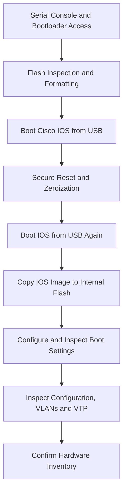

# Cisco Catalyst 2960-X | Hands-On Network Infrastructure Project

### **NIST-Aligned Secure Sanitization • Cisco IOS Reinstallation • Boot Configuration • Post-Reimage Validation**

<p align="center">
  
</p>

## Overview

This project documents hands-on work with a **physical Cisco Catalyst 2960-X (WS-C2960X-24TS-L)** enterprise switch. I connected to the switch through a serial console using Tera Term, worked in the Cisco bootloader and IOS CLI, performed authorized sanitization operations, recovered an IOS image from USB, configured the boot path, and reviewed the device configuration after recovery.

The work was performed on actual network equipment, not in a simulator. The screenshots below document the commands and output captured during the process.

**Equipment:** Cisco Catalyst WS-C2960X-24TS-L  
**IOS image:** `c2960x-universalk9-mz.152-7.E11.bin`  
**Tools:** Tera Term, serial console, USB flash drive, Cisco bootloader and IOS CLI

## Table of Contents

- [Equipment Photos](#equipment-photos)
- [Hardware and Tools](#hardware-and-tools)
- [Work Completed](#work-completed)
- [Recovery Workflow](#recovery-workflow)
- [CLI Walkthrough](#cli-walkthrough)
  - [01 — Flash Formatting](#phase-01)
  - [02 — IOS Boot from USB](#phase-02)
  - [03 — Secure Factory Reset](#phase-03)
  - [04 — FIPS Zeroization](#phase-04)
  - [05 — Bootloader Inspection](#phase-05)
  - [06 — Post-Zeroization IOS Boot](#phase-06)
  - [07 — IOS Installation and Boot Configuration](#phase-07)
  - [08 — Running Configuration](#phase-08)
  - [09 — Startup Configuration](#phase-09)
  - [10 — VLAN Inspection](#phase-10)
  - [11 — VTP and Power Inspection](#phase-11)
  - [12 — Hardware Inventory](#phase-12)
- [Verification Summary](#verification-summary)
- [Project Files](#project-files)
- [About](#about)

---

## Equipment Photos

### Cisco Catalyst 2960-X — Full Switch

<p align="center">
  
</p>

### Front Panel and SFP Uplinks

<p align="center">
  
</p>

*The office backgrounds in the equipment photographs were digitally modified. The CLI screenshots below document the switch operations.*

<p align="right"><a href="#table-of-contents">↑ Back to Table of Contents</a></p>

---

## Hardware and Tools

| Item | Details |
|---|---|
| Switch | Cisco Catalyst WS-C2960X-24TS-L |
| Switch type | Layer 2 enterprise access switch |
| Access ports | 24 × Gigabit Ethernet |
| Uplinks | 4 × 1G SFP |
| PoE | Not supported on this model |
| Operating system | Cisco IOS |
| IOS recovery image | `c2960x-universalk9-mz.152-7.E11.bin` |
| Console connection | Serial |
| Terminal software | Tera Term |
| Recovery media | USB flash drive |
| Environment | Isolated physical device |

<p align="right"><a href="#table-of-contents">↑ Back to Table of Contents</a></p>

---

## Work Completed

- Accessed the Cisco bootloader and inspected flash and USB storage.
- Performed flash formatting and authorized sanitization and zeroization commands.
- Booted Cisco IOS from a USB recovery image.
- Copied the IOS image to internal flash storage.
- Configured the boot image and inspected the boot settings.
- Reviewed running and startup configurations.
- Checked VLAN and VTP information.
- Identified the physical switch model through the IOS inventory command.
- Recorded the CLI output across 12 documented phases.

<p align="right"><a href="#table-of-contents">↑ Back to Table of Contents</a></p>

---

## Recovery Workflow



<p align="right"><a href="#table-of-contents">↑ Back to Table of Contents</a></p>

---

## CLI Walkthrough

The following screenshots were captured during the switch recovery and verification process. Commands are included to identify the operation shown in each capture.

<a id="phase-01"></a>
### Phase 01 — Flash Formatting

**Commands**

```text
format flash:
dir flash:
```

Accessed the internal flash filesystem through the bootloader, formatted flash, and inspected its contents afterward. Flash formatting removes filesystem contents; it is not, by itself, a complete sanitization verification.


**Recorded:** Flash formatting and directory inspection.

<p align="right"><a href="#table-of-contents">↑ Back to Table of Contents</a></p>

---

<a id="phase-02"></a>
### Phase 02 — IOS Boot from USB

**Command**

```text
boot usbflash0:c2960x-universalk9-mz.152-7.E11.bin
```

Started Cisco IOS directly from the recovery image on the USB flash drive using the bootloader.


**Recorded:** USB-based IOS boot sequence.

<p align="right"><a href="#table-of-contents">↑ Back to Table of Contents</a></p>

---

<a id="phase-03"></a>
### Phase 03 — Secure Factory Reset

**Command**

```text
factory-reset all secure
```

Executed the authorized secure factory-reset operation. The screenshot records the command and related console output; separate acceptance checks are needed to certify sanitization.


**Recorded:** Secure factory-reset activity and prompts.

<p align="right"><a href="#table-of-contents">↑ Back to Table of Contents</a></p>

---

<a id="phase-04"></a>
### Phase 04 — FIPS Zeroization

**Commands**

```text
configure terminal
fips zeroize
```

Ran the device's zeroization command as part of the authorized sanitization sequence. Zeroization addresses applicable cryptographic security material and may affect saved device state.


**Recorded:** Zeroization command activity and console response.

<p align="right"><a href="#table-of-contents">↑ Back to Table of Contents</a></p>

---

<a id="phase-05"></a>
### Phase 05 — Bootloader Inspection

**Commands**

```text
set
dir usbflash0:
```

Reviewed bootloader environment variables and checked the USB directory for the recovery image.


**Recorded:** Bootloader settings and USB directory contents.

<p align="right"><a href="#table-of-contents">↑ Back to Table of Contents</a></p>

---

<a id="phase-06"></a>
### Phase 06 — Post-Zeroization IOS Boot

**Command**

```text
boot usbflash0:c2960x-universalk9-mz.152-7.E11.bin
```

Booted IOS from the USB image again following the reset and zeroization sequence to continue recovery from the IOS CLI.


**Recorded:** Second USB-based IOS boot.

<p align="right"><a href="#table-of-contents">↑ Back to Table of Contents</a></p>

---

<a id="phase-07"></a>
### Phase 07 — IOS Installation and Boot Configuration

**Image transfer**

```text
copy usbflash0: flash:
```

**IOS image:** `c2960x-universalk9-mz.152-7.E11.bin`

**Boot configuration**

```text
configure terminal
boot system flash:c2960x-universalk9-mz.152-7.E11.bin
end
copy running-config startup-config
show boot
```

Copied the IOS recovery image to internal flash, set the boot image, saved the configuration, and inspected the boot setting. The captured commands verify the configured path, not a separate USB-free reboot.


**Recorded:** IOS transfer, boot configuration, and `show boot` output.

<p align="right"><a href="#table-of-contents">↑ Back to Table of Contents</a></p>

---

<a id="phase-08"></a>
### Phase 08 — Running Configuration

**Command**

```text
show running-config
```

Inspected the active IOS configuration for existing device settings and the state following recovery.


**Recorded:** Running-configuration output.

<p align="right"><a href="#table-of-contents">↑ Back to Table of Contents</a></p>

---

<a id="phase-09"></a>
### Phase 09 — Startup Configuration

**Command**

```text
show startup-config
```

Inspected the saved configuration. The running and startup configurations were checked separately because they represent different configuration states.


**Recorded:** Startup-configuration output.

<p align="right"><a href="#table-of-contents">↑ Back to Table of Contents</a></p>

---

<a id="phase-10"></a>
### Phase 10 — VLAN Inspection

**Command**

```text
show vlan
```

Checked the VLAN database. The captured output shows default VLAN information without a visible customer-created VLAN.


**Recorded:** VLAN information from the switch.

<p align="right"><a href="#table-of-contents">↑ Back to Table of Contents</a></p>

---

<a id="phase-11"></a>
### Phase 11 — VTP and Power Inspection

**Commands**

```text
show vtp status
show power inline
```

Reviewed VTP status and power capability. The WS-C2960X-24TS-L is a non-PoE model, so PoE functionality is not expected.


**Recorded:** VTP status and power-related output.

<p align="right"><a href="#table-of-contents">↑ Back to Table of Contents</a></p>

---

<a id="phase-12"></a>
### Phase 12 — Hardware Inventory

**Command**

```text
show inventory
```

Checked the hardware inventory to confirm the switch model as **Cisco Catalyst WS-C2960X-24TS-L**. Serial-number information was redacted from the published capture.


**Recorded:** Hardware inventory and model identification.

<p align="right"><a href="#table-of-contents">↑ Back to Table of Contents</a></p>

---

## Verification Summary

| Check | Record |
|---|---|
| Bootloader and USB inspection | Captured |
| Internal flash formatting | Captured |
| IOS boot from USB | Captured |
| Secure factory-reset command | Captured |
| FIPS zeroization command | Captured |
| IOS transfer to internal flash | Captured |
| Boot configuration and inspection | Captured |
| Running and startup configuration review | Captured |
| VLAN and VTP review | Captured |
| Hardware model identification | Captured |
| Independent reboot from flash without USB | Not documented |
| End-to-end physical port tests | Not documented |
| Formal sanitization sign-off | Not included in public documentation |

The summary describes the evidence available in this repository. It is not a formal hardware test certificate or sanitization certificate.

<p align="right"><a href="#table-of-contents">↑ Back to Table of Contents</a></p>

---

## Project Files

- [Technical report (PDF)](Cisco_2960X_Sanitation%2BReimage.pdf)
- [Equipment photos and logo](assets/)
- [CLI evidence screenshots](evidence/)

```text
Cisco-Catalyst-2960X-Hands-On-Infrastructure-Project/
├── README.md
├── Cisco_2960X_Sanitation+Reimage.pdf
├── assets/
│   ├── brandons-logo.png
│   ├── c2960x-whole.png
│   └── c2960x-front.png
└── evidence/
    ├── 2960x-step1.png
    ├── 2960x-step2.png
    ├── 2960x-step3.png
    ├── 2960x-step4.png
    ├── 2960x-step5.png
    ├── 2960x-step6.png
    ├── 2960x-step7.png
    ├── 2960x-step8.png
    ├── 2960x-step9.png
    ├── 2960x-step10.png
    ├── 2960x-step11.png
    └── 2960x-step12.png
```

<p align="right"><a href="#table-of-contents">↑ Back to Table of Contents</a></p>

---

## About

I'm Brandon Stevenson, an IT Infrastructure Technician focused on enterprise systems, networking, and hardware troubleshooting. I document hands-on projects to show the equipment, tools, commands, and results behind my work.

[Portfolio](https://brandons-resume.com) · [GitHub](https://github.com/Programmer-stevenson) · [LinkedIn](https://www.linkedin.com/in/brandon-in-tech/)

*Any employer-owned information or device evidence included in this repository must be authorized for public release. Confidential identifiers and internal procedures should not be published.*

<p align="right"><a href="#table-of-contents">↑ Back to Table of Contents</a></p>
